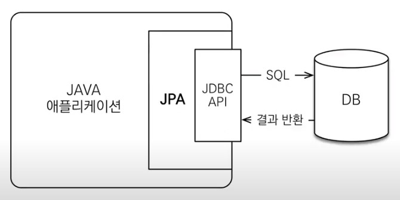
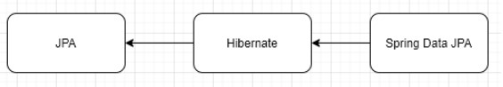
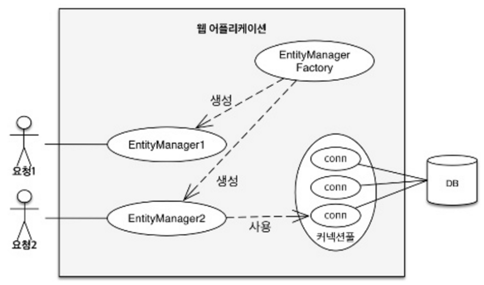
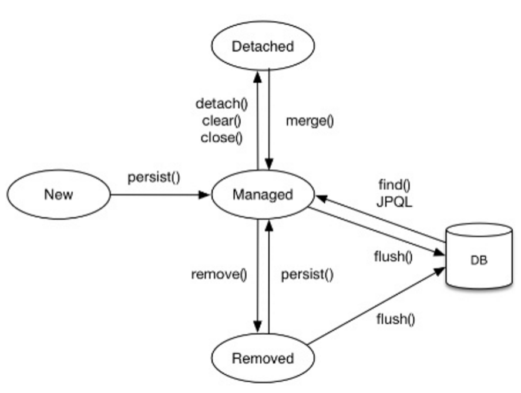
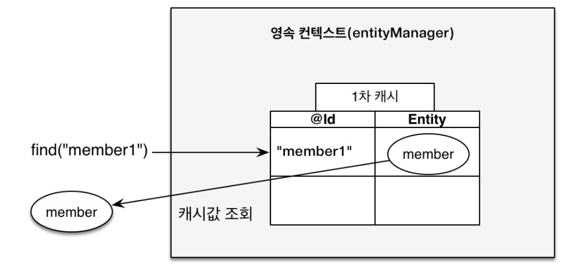
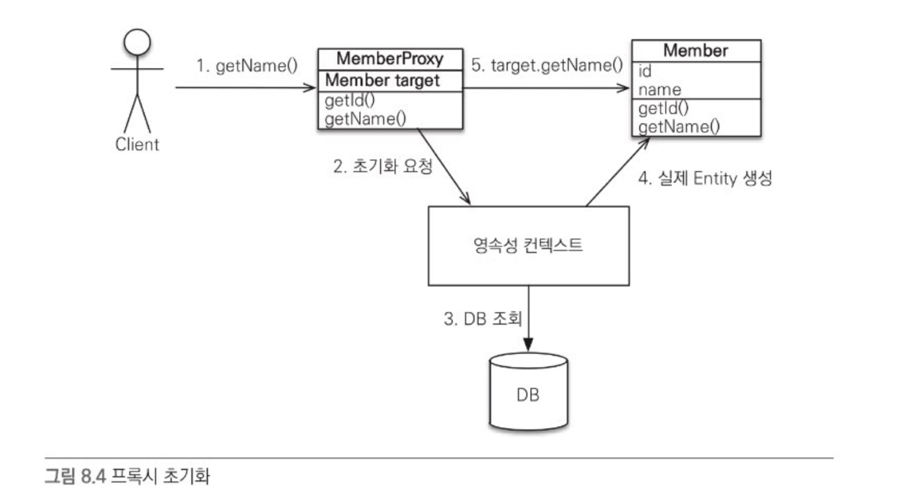

# ORM(Object Relational Mapping)이란?  
__`'객체 - 관계형 데이터베이스를 매핑하는 프로그래밍 기법'`__  
객체가 관계형 데이터 베이스의 테이블이 되도록 매핑 시켜주는 것이다.

__왜 객체와 관계형 데이터베이스 간의 매핑을 지원해주는 Framework나 Tool들이 나오는 것일까?__  
ORM framework나 도구가 없던 시절에도 이미 우리는 OOP를 하면서 객체와 관계형 데이터베이스를 모두 잘 사용하고 있었음에도 불구하고, 굳이 이런 새로운 개념들이 나오게 되는 이유는 <u>"Back to basics(기본에 충실하자)"</u> 을 지키기 위해서라고 볼 수 있다. 즉, 보다 OOP(Object_Oriented Programming)다운 프로그래밍을 하자는데부터 출발한 것이다.

그럼 과연 무엇이 문제였던 것일까? 우리가 어떤 어플리케이션을 만든다고 하면 관련된 정보들을 객체에 담아 보관하게 된다. 객체와 그와 연결된 객체들을 데이터베이스의 테이블에 저장 한다는 것이다. 즉, 테이블(Table)에 객체가 가지고 있던 정보를 입력하고, 이 테이블들을 "join"과 같은 SQL 질의어를 통해 관계 설정을 해 주게 된다. 여기서 문제는 이 테이블과 객체간의 이질성이 발생 하게 된다는 것이다.

이 객체간의 관계를 바탕으로 SQL을 자동 생성하여 아질성을 해결하는 것이 ORM이다.
ORM을 이용하면 SQL Query가 아닌 직관적인 코드(메서드)로서 DB의 데이터를 조작 가능하다.

#### 객체 지향 언어별로 이 ORM 사용을 사용하고 있다.
>- Django : ORM cookbook
>- Node.js : Sequalize
>- Java : Hibernate, JPA  


## __사용 예시 ex)__
보통 ORM Framwork들은 이러한 이질성을 해결하기 위해서 객체와 테이블간의 관계를 설정하여 자동으로 처리하게 되는데 예시를 통해 확인하면 다음과 같다.
``` java
public class Person{
    private String name;
    private String height;
    private String weight;
    private String ssn;
    //implement getter & setter methods
}
```
iBatis(MyBatis)의 경우에는 다음과 같이 mapping file내에서 해당 query의 결과를 받을 객체를 지정해 줄 수 있다
``` java
// iBatis
<select id="getPerson" resultClass="net.agilejava.person.domain.Person">
    SELECT name, height, weight, ssn FROM USER WHERE name = #name#;
</select>
```
즉, getPerson 이라고 정의된 질의어 결과는 net.agilejava.person.domain의 Person객체에 자동으로 mapping 되는 것이다. Hibernate의 경우에는 mapping 파일에서 다음과 같이 표현을 해준다.
``` java
// Hibernate
<hibernate-mapping>
    <class name="net.agilejava.person.domain.Person" table="person">
        <id name="name" column="name"/>
        <property name="height" column="height"/>
        <property name="weight" column="weight"/>
        <property name="ssn" column="ssn"/>
    <class>
</hibernate-mapping>
```

## ORM의 장점
> 1. 객체 지향적인 코드로 인해 더 직관적이고 비즈니스 로직에 더 집중할 수 있게 도와준다.
> 1. 선언문,ㅔ 할당, 종료 같은 부수적인 코드가 없거나 급격히 줄어든다.
> 1. 각종 객체에 대한 코드를 별도로 작성하기 때문에 코드의 가독성을 올려준다.
> 1. SQL의 절차적이고 순차적인 접근이 아닌 객체 지향적인 접근으로 인해 생산성이 증가한다.
> 1. 재사용 및 유지보수의 편리성이 증가한다.
> 1. ORM은 독립적으로 작성되어있고, 해당 객체들을 재활용 할 수 있다.
> 1. 때문에 모델에서 가공된 데이터를 컨트롤러에 의해 뷰와 합쳐지는 형태로 디자인 패턴을 견고하게 다지는데 유리하다.
> 1. 매핑정보가 명확하여, ERD를 보는 것에 대한 의존도를 낮출 수 있다.
> 1. DBMS에 대한 종속성이 줄어든다.
> 1. 대부분 ORM 솔루션은 DB에 종속적이지 않다.
> 1. 종속적이지 않다는것은 구현 방법 뿐만아니라 많은 솔루션에서 자료형 타입까지 유효하다.
> 1. 프로그래머는 Object에 집중함으로 극단적으로 DBMS를 교체하는 거대한 작업에도 비교적 적은 리스크와 시간이 소요된다.
> 1. 또한 자바에서 가공할경우 equals, hashCode의 오버라이드 같은 자바의 기능을 이용할 수 있고, 간결하고 빠른 가공이 가능하다.

## ORM의 단점
> 1. 완벽한 ORM 으로만 서비스를 구현하기가 어렵다.
> 1. 사용하기는 편하지만 설계는 매우 신중하게 해야한다.
> 1. 프로젝트의 복잡성이 커질경우 난이도 또한 올라갈 수 있다.
> 1. 잘못 구현된 경우에 속도 저하 및 심각할 경우 일관성이 무너지는 문제점이 생길 수 있다.
> 1. 일부 자주 사용되는 대형 쿼리는 속도를 위해 SP를 쓰는등 별도의 튜닝이 필요한 경우가 있다.
> 1. DBMS의 고유 기능을 이용하기 어렵다. (하지만 이건 단점으로만 볼 수 없다 : 특정 DBMS의 고유기능을 이용하면 이식성이 저하된다.)
> 1. 프로시저가 많은 시스템에선 ORM의 객체 지향적인 장점을 활용하기 어렵다.
> 1. 이미 프로시저가 많은 시스템에선 다시 객체로 바꿔야하며, 그 과정에서 생산성 저하나 리스크가 많이 발생할 수 있다.

# 그렇다면  JPA란?
`'Java Persistence API'의 약어로 ORM을 Java 언어에 맞게 사용하는 '스펙'이다.`


자바 어플리케이션에서 관계형 데이터베이스를 사용하는 방식을 정의한 __인터페이스__ 이다.
### __JPA는 인터페이스다? => 구현체가 필요하다!!__
ORM은 객체를 매핑, SQL Mapper는 쿼리를 매핑
__왜? JPA를 사용해야 하는가?__
> 1. SQL 중심적인 개발에서 객체 중심으로 개발
>   -> 부모-자식 관계표현 / 1:N 관계표현 / 객체지향 프로그래밍을 쉽게 할 수 있다
> 1. 생산성
> 1. 유지보수
> 1. 패러다임의 불일치 해결
> 1. 네이티브 쿼리만큼의 성능을 낼 수 있다.
> 1. 데이터 접근 추상화와 벤더 독립성
> 1. 표준
> 1. 직접 CRUD 쿼리를 작성할 필요가 없음

# Spring Data JPA
`하이버네이트와 같은 구현체를 좀 더 쉽게 사용하고자 추상화 시킨 모듈`


#### Spring Data JPA 를 쓰는 이유는?
1. 구현체 교체의 용이성
    + 대표적인 구현체인 Hibernate가 수명이 다했다고 가정을 하게 된다면, 다른 새로운 구현체로 쉽게 교체가 가능하다. -> Spring Data JPA내부에서 구현체 매핑을 지원해 줌
2. 저장소 교체의 용이성
    + 관계형 데이터베이스 외에 다른 저장소로 쉽게 교체 가능하다! 
        -> 의존성만 교체하면 된다.

## 깨알 지식 Maven과 Gradle의 차이

### Maven:
아파치 앤트의 대안으로 만들어짐. 아파치 라이센스로 배포되는 오픈 소스 소프트웨어 => 프로젝트를 진행하면서 사용하는 수 많은 라이브러리들을 관리해주는 도구.

### Gradle:
기본적으로 빌드 배포 도구. 안드로이드 앱 공식 ㅁㅈㅇ빌드 시스템. 빌드 속도가 maven에 비해 10~100배 가량 빠름. JAVA, C/C++, Python등을 지원. 빌드툴인 Ant Builder와 그루비 스크립트를 기반으로 구축되어 기존 Ant의 역할과 배포 스크립트의 기능을 모두 사용 가능. => 라이브러리 관리, 프로젝트 관리, 단위 테스트 시 의존성 관리.

maven은 프로젝트가 커질수록 빌드 스크립트의 내용이 길어지고 가독성이 떨어짐. gradle은 훨씬 적은 양의 스크립트로 짧고 간결하게 작성. maven의 경우 멀티 프로젝트에서 특정 설정을 다른 모듈에서 사용하려면 상속을 받아야함. gradle은 설정 주입 방식을 사용 => 멀티 프로젝트에 매우 적합!

# 영속성 관리

**객체와 관계형 데이터베이스를 매핑하는 것(Object Relational Mapping)** 과 **영속성 컨텍스트를 이해하는 것**

엔티티 매니저 : 엔티티를 저장, 수정, 삭제, 조회하는 등 엔티티와 관련된 모든 일을 처리

     ㄴ 엔티티를 저장하는 가상의 데이터베이스로 생각

## 3.1 엔티티 매니저 팩토리와 엔티티 매니저

데이터베이스를 하나만 사용하는 애플리케이션은 일반적으로 EntityManagerFactory를 하나만 생성한다.

```java
// 공장 만들기, 비용이 아주 많이 든다.
EntityManagerFactory emf =
			Persistence.createEntityManagerFactory("jpabook");

// persistence.xml 코드
<persistence-unit name="jpabook">
	<properties>
		<property name="javax.persistence.jdbc.driver"
			value="org.h2.Driver"/>
		<property name="javax.persistence.jdbc.driver"
			value="sa"/>
		<property name="javax.persistence.jdbc.driver"
			value=""/>
		<property name="javax.persistence.jdbc.driver"
			value="jdbc:h2:tcp://localhost/~/test"/>
		...
</persistence-unit>
```

이제부턴 필요할 때마다 엔티티 매니저 팩토리에서 엔티티 매니저를 생성하면 된다.

```java
// 공장에서 엔티티 매니저 생성, 비용이 거의 안 든다.
EntityManager em = emf.createEntityManager();
```

엔티티 매니저 팩토리는 여러 스레드가 동시에 접근해도 안전하므로 서로 다른 스레드 간에 공유해도 되지만, 엔티티 매니저는 여러 스레드가 동시에 접근하면 동시성 문제가 발생하므로 스레드 간에 절대 공유하면 안 된다.



트랜잭션을 시작할 때 커넥션을 획득한다.

## 3.2 영속성 컨텍스트란?

**엔티티를 영구 저장하는 환경**

엔티티 매니저로 엔티티를 저장하거나 조회하면 엔티티 매니저는 영속성 컨텍스트에 엔티티를 보관하고 관리한다.

영속성 컨텍스트는 논리적인 개념이므로 눈에 보이지 않는다.

``` java
em.persist(member);
```

→ 회원 엔티티를 저장한다. → persist() 메소드는 **엔티티 매니저를 사용해서 회원 엔티티를 영속성 컨텍스트에 저장한다**.

여러 엔티티 매니저가 같은 영속성 컨텍스트에 접근할 수도 있다.

## 3.3 엔티티의 생명주기

- 비영속(new/transient) : 영속성 컨텍스트와 전혀 관계가 없는 상태

    ㄴ 엔티티 객체를 생성. 아직은 순수한 객체 상태이며 아직 저장하지 않았다.
    
    → 영속성 컨텍스트나 DB와는 전혀 관련이 없다.

    ```java
    // 객체를 생성한 상태(비영속)
    Member member = new Member();
    member.setId("member1");
    member.setUsername("회원1");
    ```

- 영속(managed) : 영속성 컨텍스트에 저장된 상태

    ㄴ 엔티티 매니저를 통해서 엔티티를 영속성 컨텍스트에 저장. 영속성 컨텍스트가 관리하는 엔티티를 **영속 상태**라 한다. → **영속성 컨텍스트에 의해 관리된다는 뜻**

    ```java
    // 객체를 저장한 상태(영속)
    em.persist(member);
    ```

- 준영속(detached) : 영속성 컨텍스트에 저장되었다가 분리된 상태

    ㄴ 영속 상태의 엔티티를 영속성 컨텍스트가 관리하지 않으면 준영속 상태가 된다.

    ```java
    // 회원 엔티티를 영속성 컨텍스트에서 분리, 준영속 상태
    em.detach(member);
    // 영속성 컨텍스트 닫기
    em.close();
    // 영속성 컨텍스트 초기화
    em.clear();
    ```

- 삭제(removed) : 삭제된 상태

    ㄴ 엔티티를 영속성 컨텍스트와 DB에서 삭제한다.

    ```java
    // 객체를 삭제한 상태(삭제)
    em.remove(member);
    ```



## 3.4 영속성 컨텍스트의 특징

1. 영속성 컨텍스트와 식별자 값

    영속성 컨텍스트는 엔티티를 식별자 값(@Id로 테이블의 기본 키와 매핑한 값)으로 구분한다. 

    → **영속 상태는 식별자 값이 반드시 있어야 한다.**

2. 영속성 컨텍스트와 DB 저장

    JPA는 보통 트랜잭션을 커밋하는 순간 영속성 컨텍스트에 새로 저장된 엔티티를 데이터베이스에 반영한다 → 플러시(flush)

3. 영속성 컨텍스트가 엔티티를 관리할 때의 장점
    - 1차 캐시
    - 동일성 보장
    - 트랜잭션을 지원하는 쓰기 지연
    - 변경 감지
    - 지연 로딩

#### 엔티티 CRUD를 통한 영속성 컨텍스트의 필요성 파악하기

### 엔티티 조회

영속 상태의 엔티티는 모두 '**1차 캐시**' 에 저장된다.

```java
// 엔티티를 생성한 상태(비영속)
Member member = new Member();
member.setId("member1");
member.setUsername("회원1");

// 객체를 저장한 상태(영속)
em.persist(member);
```



1차 캐시에 엔티티 저장 (DB에 반영 X)

```java
// 엔티티 조회
Member member = em.find(Member.class, "member1");
```

1차 캐시의 키는 식별자 값( ⇒ 데이터베이스 기본 키와 매핑)이다. 

```java
// EntityManager.fine() 메소드 정의
public <T> T find(Class<T> entityClass, Object primaryKey);
// 파라미터 -> 엔티티 클래스 타입, 조회할 엔티티의 식별자 값
```

em.find()호출 시 먼저 1차 캐시에서 엔티티를 찾고 없을 시 DB에서 조회

```java
Member member = new Member();
member.setId("member1");
member.setUsername("회원1");

// 1차 캐시에 저장됨
em.persist(member);

// 1차 캐시에서 조회
Member findMember = em.find(Member.class, "member1");
```

- **데이터베이스에서 엔티티 조회 순서**
    1. em.find(Member.class, "member") 실행
    2. member가 1차 캐시에 없을 시 데이터베이스에서 조회
    3. 조회한 데이터로 member 엔티티를 생성해서 1차 캐시에 저장(영속 상태)
    4. 조회한 데이터를 반환
- 영속 엔티티의 동일성 보장

```java
Member a = em.find(Member.class, "member1");
Member b = em.find(Member.class, "member1");

System.out.println(a == b);  // 동일성 비교
// 결과 : 참
```

영속성 컨텍스트에서는 1차 캐시에 있는 같은 엔티티 인스턴스를 반환하기 때문에 결과는 참이다. **영속성 컨텍스트는 성능상 이점과 엔티티의 동일성을 보장한다.**

> 동일성(Identity): 실제 인스턴스가 같다.
>
> 동등성(equality): 실제 인스턴스는 다를 수 있지만 인스턴스가 가지고 있는 값이 같다.
>
> java에서 동등성 비교는 equals() 메소드를 구현해야 한다.

### 엔티티 등록
---
```java
// 엔티티 등록 코드
EntityManager em = emf.createEntityManager();
EntityTransaction transaction = em.getTransaction();
// 엔티티 매니저는 데이터 변경 시 트랜잭션을 시작해야 한다.
transaction.begin();  // [트랜잭션] 시작

em.persist(memberA);
em.persist(memberB);
// 여기까지 INSERT SQL을 데이터베이스에 보내지 않는다.

// 커밋하는 순간 데이터베이스에 INSERT SQL을 보낸다.
transaction.commit();  // [트랜잭션] 커밋
```

엔티티 매니저는 트랜잭션을 커밋하기 전까진 DB에 엔티티를 저장하지 않고 영속성 컨텍스트 내부 쿼리 저장소에 INSERT SQL을 모아두다가 트랜잭션을 커밋할 때 모아둔 쿼리를 데이터베이스에 보내는데 이것을 **트랜잭션을 지원하는 쓰기 지연(transactional write-behind)** 라 한다.

### 트랜잭션을 지원하는 쓰기 지연이 가능한 이유
---

```java
begin();  // 트랜잭션 시작

save(A);
save(B);
save(C);

commit();  // 트랜잭션 커밋
```

1. 데이터를 저장하는 즉시 등록 쿼리를 데이터베이스에 보낸다.
2. 데이터를 저장하면 등록 쿼리를 데이터베이스에 보내지 않고 메모리에 모아둔다.

### 엔티티 수정

---

- SQL 수정 쿼리의 문제점
    1. 수정 쿼리가 많아짐
    2. 비즈니스 로직을 분석하기 위해 SQL을 계속 확인해야 함
    3. 간, 직접적으로 비즈니스 로직이 SQL에 의존하게 됨

```java
// 엔티티 수정
EntityManager em = emf.createEntityManager();
EntityTransaction transaction = em.getTransaction();
transaction.begin();

//영속 엔티티 조회
Member memberA = em.find(Member.class, "memberA");

//영속 엔티티 데이터 수정
memberA.setUsername("hi");
memberA.setAge(10);

transaction.commit();
```

엔티티의 변경사항을 데이터베이스에 자동으로 반영하는 기능 → **변경 감지(dirty checking)**

### 변경 감지(Dirty Checking)

---

스냅샷 : JPA가 엔티티를 영속성 컨텍스트에 보관할 때, 최초 상태를 복사해서 저장해주는 것

플러시 시점에 스냅샷과 엔티티를 비교해서 변경된 엔티티를 찾는다.

1. 트랜잭션을 커밋하면 엔티티 매니저 내부에서 먼저 flush() 호출
2. 엔티티와 스냅샷을 비교해서 변경된 엔티티를 찾는다
3. 변경된 엔티티가 있으면 수정 쿼리를 생성해서 쓰기 지연 SQL 저장소에 보낸다
4. 쓰기 지연 저장소의 SQL을 데이터베이스에 보낸다
5. 데이터베이스 트랜잭션을 커밋한다

변경 감지는 영속성 컨텍스트가 관리하는 영속 상태의 엔티티에만 적용된다.

### 엔티티 삭제

---

```java
// 선 조회, 후 삭제
Member memberA = em.find(Member.class, "memberA"); // 삭제 대상 엔티티 조회
em.remove(memberA);  // 엔티티 삭제
```

엔티티 즉시 삭제 X → 엔티티 등록과 비슷하게 삭제 쿼리를 쓰기 지연 SQL 저장소에 등록 → 트랜잭션을 커밋해서 플러시를 호출하면 실제 DB에 삭제 쿼리를 전달

em.remove(memberA)를 호출하는 순간 memberA는 영속성 컨텍스트에서 제거된다.

## 3.5 플러시

**플러시(flush())** 는 영속성 컨텍스트의 변경 내용을 데이터베이스에 반영한다.

- 플러시 실행시
    1. 변경 감지가 동작해서 영속성 컨텍스트에 있는 모든 엔티티를 스냅샷과 비교해서 수정된 엔티티를 찾는다. 수정된 엔티티는 수정 쿼리를 만들어 쓰기 지연 SQL 저장소에 등록한다.
    2. 쓰기 지연 SQL 저장소의 쿼리를 DB에 전송한다(등록, 수정, 삭제 쿼리)

- 영속성 컨텍스트를 플러시하는 방법
    1. em.flush() 를 직접 호출한다.

        ㄴ 엔티티 매니저의 flush() 메소드를 직접 호출해서 영속성 컨텍스트를 강제로 플러시한다.

        테스트나 다른 프레임워크와 JPA를 함께 사용할 때를 제외하고 거의 사용 X

    2. 트랜잭션 커밋 시 플러시가 자동 호출된다.

        ㄴ DB에 변경 내용을 SQL로 전달하지 않고 트랜잭션만 커밋하면 어떤 데이터도 데이터베이스에 반영되지 않는다. → JPA에선 트랜잭션을 커밋할 때 플러시를 자동으로 호출

    3. JPQL 쿼리 실행 시 플러시가 자동 호출된다.

        ㄴ JPQL이나 Criteria 같은 객체지향 쿼리를 호출할 때도 플러시가 실행된다.

```java
em.persist(memberA);    // 영속 ( 영속성 컨텍스트에 있지만 DB에 반영 X )
em.persist(memberB);
em.persist(memberC);

// 중간에 JPQL 실행
query = em.createQuery("select m from Member m", Member,class);
List<Member> members=query.getResultList();
```

find() 메소드를 호출할 때는 플러스가 실행되지 않는다(식별자를 기준으로 조회하기 때문)

엔티티 매니저에 플러시 모드를 직접 지정하려면

```java
javax.persistence.FlushModeType.AUTO|COMMIT
```

.AUTO: 커밋이나 쿼리를 실행할 때 플러시(default)

.COMMIT: 커밋할 때만 플러시

### **플러시라는 이름으로 인해 영속성 컨텍스트에 보관된 엔티티를 지운다? X**

### 💡 영속성 컨텍스트의 변경 내용을 데이터베이스에 동기화하는 것이 플러시이다.

## 3.6 준영속

**준영속 상태의 엔티티는 영속성 컨텍스트가 제공하는 기능을 사용할 수 없다.**

- 영속 상태의 엔티티를 준영속 상태로 만드는 방법
    1. em.detach(entity): 특정 엔티티만 준영속 상태로 전환

        ```java
        // detach() 메소드 정의
        public void detach(Object entity);

        // detach() 테스트 코드
        public void testDetached() {
        	Member member = new Member();
        	member.setId("memberA");
        	member.setUsername("회원A");

        	em.persist(member);

        	em.detach(member);
        	
        	transaction.commit();
        ```

    2. em.clear(): 영속성 컨텍스트를 완전히 초기화

        ㄴ 영속성 컨텍스트 내의 모든 엔티티를 준영속 상태로 만든다.

        ```java
        // 영속성 컨텍스트 초기화
        Member member = em.find(Member.class, "memberA");

        em.clear();

        member.setUsername("changeName");    // DB에 반영 X
        ```

    3. em.close(): 영속성 컨텍스트를 종료

        ```java
        public void closeEntityManager() {

        	EntityManagerFactory emf =
        			Persistence.createEntityManagerFactory("jpabook");

        	EntityManager em = emf.createEntityManager();
        	EntityTransaction transaction = em.getTransaction();

        	transaction.begin();    // [트랜잭션] - 시작

        	Member memberA = em.find(Member.class, "memberA");
        	Member memberB = em.find(Member.class, "memberB");

        	transaction.commit();   // [트랜잭션] - 커밋

        	em.close(); // 영속성 컨텍스트 닫기(종료)
        }
        ```

- 준영속 상태의 특징
    - 거의 비영속 상태에 가깝다

        1차 캐시, 쓰기 지연, 변경 감지, 지연 로딩을 포함한 영속성 컨텍스트가 제공하는 어떠한 기능도 동작하지 않는다.

    - 식별자 값을 가지고 있다

        비영속 상태는 식별자 값이 없을 수도 있지만 준영속 상태는 이미 한 번 영속 상태였으므로 반드시 식별자 값을 가지고 있다.

    - 지연 로딩을 할 수 없다

        지연 로딩(Lazy Loading)은 실제 객체 대신 프록시 객체를 로딩해두고 해당 객체를 실제 사용할 때 **영속성 컨텍스트를 통해 데이터를 불러오는 방법**

### 병합(Merge())

    ㄴ 준영속 상태의 엔티티 정보를 받아서 새로운 영속 상태의 엔티티 반환

```java
// merge() 메소드 정의
public <T> T merge(T entity);

// merge() 사용 예
Member mergeMember = em.merge(member);
```

# 프록시와 연관관계 관리

다룰 내용

-프록시와 즉시로딩, 지연로딩

:객체가 DB에 저장되어 있어서 연관된 객체를 마음껏 탐색하기 어렵다.

→ 문제 해결을 위해 프록시라는 기술 사용.

-프록시 사용효과

:연관된 객체를 처음부터 가져오는 것이 아니라 실제로 사용되는 시점에서 조회가 가능

→ 자주 함께 사용하는 객체들은 조인을 통해 함게 조회하는것이 효과적.

# 프록시

:엔티티를 조회할때 연관된 엔티티들이 항상 사용되는 것은 아니다.

```java
//회원과 팀 함께 출력
public void printUserAndTeam(String memberId) {
 Member member = em.find(Member.class, memberId);
 Team team = member.getTeam();
 System.out.println("회원 이름: " + member.getUsername()); 
 System.out.println("소속팀: " + team.getName()); 
}
```

```java
//회원만 출력
public void printUser(String memberId) {
 Member member = em.find(Member.class, memberId);
 Team team = member.getTeam();
 System.out.println("회원 이름: " + member.getUsername()); 
}
```

위의 코드들은 보면 회원만 출력하는 경우 em.find()로 회원을 찾을 경우 팀까지 조회하는 것은 효율적이지 않다.

JPA에서는 이러한 문제를 해결하기 위해 데이터 베이스 조회를 지연하는 방법을 제공하는데 이것이 **지연 로딩**이다.

이 지연로딩 기능을 사용하려면 **실제 엔티티 객체 대신에 데이터베이스 조회를 지연할 수 있는 가짜 객체가 필요한데 이것을 프록시 객체**라 한다.

### 프록시 기초(em.find() vs em.getReference())

Jpa에서 엔티티를 조회할 때 : em.find()

→ 실제 사용하든 안하든 데이터베이스를 조회.

지연로딩처럼 데이트베이스 조회를 미루고 싶을때 : em.getReference() 사용

→jpa는 데이터베이스를 조회하지 않고 실제 엔티티 객체도 생성하지 않는다.

→ 단지 프록시 객체를 반환한다.



-프록시 특징

:실제 클래스를 상속 받아서 만들어짐.

→ 실제 클래스와 겉 모양이 같음.

→ 사용하는 입장에서 진짜 객체인지 프록시 객체인지 구분하지 않고 사용.

:실제 객체의 참조를 보관.

→프록시 객체를 호출하면 실제 객체의 메소드 호출


-프록시 객체의 초기화

:실제로 사용될 때 데이터베이스를 조회해서 실제 엔티티 객체를 생성

```java
Member member = em.getReference(Member.class, “id1”); 
member.getName(); //실제 프록시 객체 초기화.
```

-초기화 과정

1.프록시 객체에서 실제 데이터를 조회한다.

2.프록시 객체는 실제 엔티티가 생성되어 있지 않으면 영속성 컨텍스트에 실제 엔티티 생성을 요청.

3.영속성 컨텍스트는 DB를 조회해서 실제 엔티티 객체를 생성.

4.프록시 객체는 실제 엔티티 객체의 참조를 멤버변수에 보관한다.

5.프록시 객체는 실제 엔티티 객체의 메소드를 호출해서 결과를 반환한다.

-프록시 특징

1. 처음 사용할 때 한 번만 초기화된다.
2. 초기화 != 실제 엔티티로 변경, 초기화 == 접근할 수 있는 참조가 생김.
3. 프록시 객체는 원본 엔티티를 상속받은 객체이므로 타입 체크 시에 주의해서 사용.
4. 영속성 컨텍스트에 찾는 엔티티가 이미 존재할 경우에는 getReference()를 사용해도 프록시가 아닌 실제 엔티티를 반환한다.
5. 초기화는 영속성의 도움을 받아야만 가능하다.

 → 준영속 상태의 프록시를 초기화하면 문제가 발생한다.

-준영속 상태와 초기화

```java
Member member = em.getReference(Member.class,"id1");
transaction.commit();
em.close();

member.getName(); // 준영속 상태 초기화 시도, 예외 발생
```

## 프록시와 식별자

엔티티를 프록시로 조회할 때 식별자 값을 파라미터로 전달하는데, **프록시 객체는 이 식별자 값을 보관**한다.

즉 프록시 객체는 식별자 값을 가지고 있으므로, 식별자 값을 조회하는 team.getId()를 호출해도 초기화하지 않는다. 단 엔티티 접근 방식을 프로퍼티(@Access(AccessType.PROPERTY))로 설정한 경우에만 초기화하지 않는다.

엔티티 접근 방식을 필드로((@Access(AccessType.Field))로 설정하면 JPA는 getId()메소드가 id만 조회하는 메소드인지 다른 필드까지 활용해서 어떤 일이 하는 메소드인지 알 수 없으므로 프록시 객체를 초기화한다.

## 프록시 확인

```java
• 프록시 인스턴스의 초기화 여부 확인
PersistenceUnitUtil.isLoaded(Object entity) 

• 프록시 클래스 확인 방법
entity.getClass().getName() 출력(..javasist.. or 
HibernateProxy…) 

• 프록시 강제 초기화
org.hibernate.Hibernate.initialize(entity); 

• 참고: JPA 표준은 강제 초기화 없음
강제 호출: member.getName()
```

## 즉시로딩과 지연로딩

프록시 객체는 주로 연관된 엔티티를 지연 로딩 할 때 사용.

\- 즉시 로딩(Eager Loading)

:엔티티를 조회할 때 연관된 엔티티도 함께 조회한다.

@ManyToOne(fetch=FetchType.Eager)

\- 지연 로딩(Lazy Loading)

:연관된 엔티티를 실제 사용할 때 조회한다.

@ManyToOne(fetch=FetchType.LAZY)

### 즉시 로딩

```java
@Entity
 public class Member {
 @Id
 @GeneratedValue
 private Long id;
 @Column(name = "USERNAME")
 private String name;
 @ManyToOne(fetch = FetchType.EAGER) //**
 @JoinColumn(name = "TEAM_ID")
 private Team team;
}

//실행코드 {
Member member = em.find(Member.class,"member1");
Team team = memger.getTeam();
}
```
위의 코드를 보면 회원을 조회하는 순간 팀도 함께 조회해야한다. 이때 회원과 팀 두 테이블을 조회해야 하므로 쿼리를 2번 실행할 것같지만 **JPA 구현체는 즉시 로딩을 최적화하기 위해 가능하면 조인쿼리를 사용해서 한번에 처리**한다.

### 지연 로딩

```java
@Entity
 public class Member {
 @Id
 @GeneratedValue
 private Long id;
 @Column(name = "USERNAME")
 private String name;
 @ManyToOne(fetch = FetchType.LAZY) //**
 @JoinColumn(name = "TEAM_ID")
 private Team team;

 }

//실행코드 {
Member member = em.find(Member.class,"member1");
Team team = memger.getTeam();
team.getName(); //실제 사용
}
```

실제 사용될 때 조회(프록시 객체 초기화). 그전에는 프록시 객체로 대체.

\- 프록시와 즉시로딩 주의

1. 가급적 지연 로딩만 사용
2. 즉시 로딩을 적용하면 상상하지 못한 쿼리문이 발생한다.
3. 즉시 로딩은 JPQL에서 N+1문제를 야기함.
4. XXX@TOONE 은 기본이 즉시 로딩 이므로 → LAZY로 변경.
5. XXX@TOMANY는 기본이 지연 로딩.
